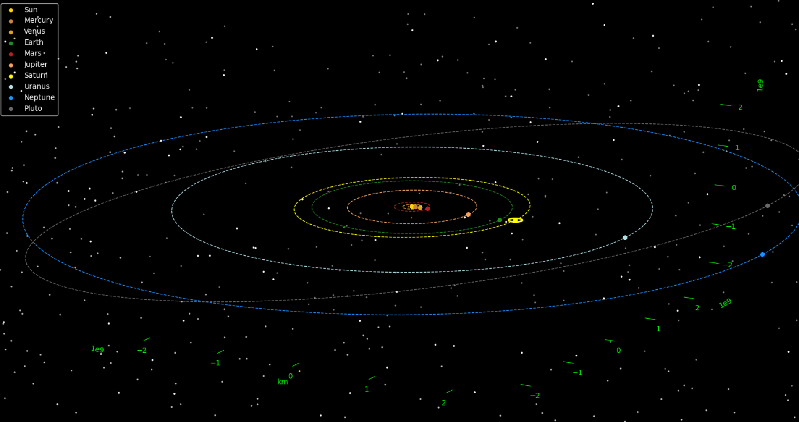

# Solar_System
Interactive model of our Solar System plotted in matplotlib in Python 3. Fun side project made to learn more about 3D animation.


### How to setup:
In terminal/cmd prompt, clone the repository into you desired location:
```bash
git clone https://github.com/Shellywell123/Solar_System.git
```

### How to update:
Navigate to program directory:
```bash
cd Solar_System/
```
In terminal/cmd prompt, pull the latest version:
```bash
git pull
```

## Usage
In terminal/cmd prompt, execute 'Solar_System.py' with python 3:
```bash
python3 Solar_System.py
```

## Features
- Approximate relative distances and scale
- Parallax background stars
- Adjustable orbits

## Potential Goals
 - Image overlays for planet surfaces (will allow for planet rotations to be visible)
 - live position of planets (animated + option to pan through time)
 - Make each dash of a planets orbit represent one day 
 - Accurate eliptical orbits with processions (all orbits currently fixed inline with x axis)
 - Accurate moons and gas rings
 - Approximate star positions and brightnesses in background
 - Add satelites and space mission trajectories
 - Add asteroid belt
